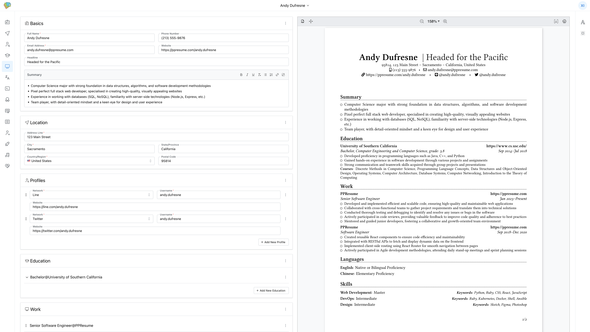
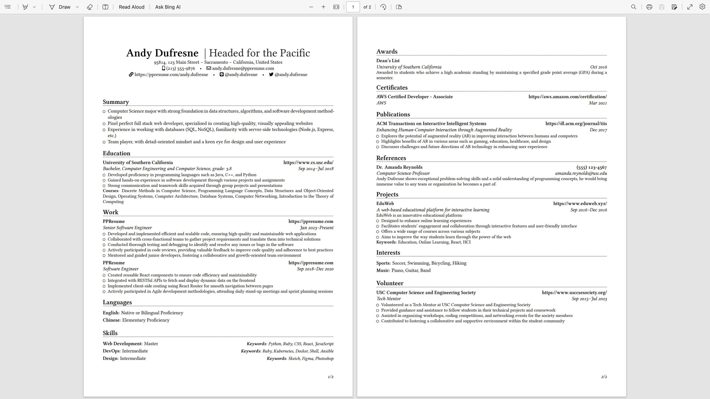
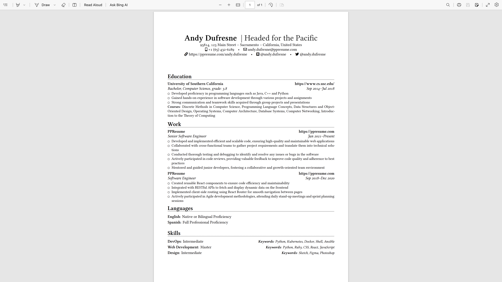

# PPResume

Pretty Print Resume, Pretty Print World

[PPResume](https://www.ppresume.com) is here to simplify your life by producing
the most visually appealing resumes in the world.

## Highlights

- State of the Art Typesetting
- Fine-tuned Typography
- Carefully Crafted Templates
- High Quality PDF Output
- Intuitive UI/UX
- Highly Customizable

## Quick Preview

### A Quick Walkthrough of PPResume

We've made a quick walkthrough video for PPResume, check it
[here](https://youtu.be/mYqSTsCw3KI).

PPResume provides an intuitive and powerful dashboard that guides you through
the tedious process of writing resumes.

### Real-time Input Validation

### Rich Set of Input Controls

### Structural Editing

### Customizable Layout

## Sample Resumes

Check out the [sample resumes](./static/samples/) generated by PPResume

### Multi Pages Resume with Page Numbers

### Single Page Resume without Page Numbers

## Community

Please use English when possible, so that everyone can understand.

- [Discord](https://discord.gg/PzbunPPkVF) - Join our Discord server if you feel
  bored or to discuss anything about PPResume.
- [Issues](https://github.com/ppresume/community/issues) - Bug report or feature
  request.
- [Discussion](https://github.com/ppresume/community/discussions) -
  Announcement, ideas, show and tell, Q&A, etc.

## TL;DR

### Motivation

Years ago, my friends asked me to help them with their resumes, and since I know
typesetting well, especially LaTeX, I was happy to help. I have helped about a
dozen friends typeset their resumes in LaTeX, and most of them are very pleased
and amazed at the beautiful, high-quality, and visually appealing PDF output.

To my surprise, some of them still come to me after several years and ask me to
help them update their resumes when they are looking for a new job.

In 2016, I opened an e-commerce store to offer help with typesetting resumes in
LaTeX. I had a few customers and was making a little money, and realized that if
you could offer people high-quality, visually appealing resumes, there might be
a market for resume typesetting.

However, I didn't have enough time to develop a service for this idea until I
was laid off in November 2022. Since I have mastered all the necessary skills to
make this idea a reality, I decided to put it into action.

The motivation behind this project is to offer a resume builder that creates the
most visually appealing resumes in the world.

### First Principles

Let us go back to the first principles of writing a resume. A resume is a piece
of paper that contains information about you, your education, work experience,
skills, etc. The goal of a resume is to help you get an offer from an
organization (be it a company, school, research institute, etc.)

What do you need to write a resume?

There are three steps required, and each step poses different requirements:

- content
  - import from LinkedIn
  - spell check
  - grammar check
  - AIGC content creation
  - guidelines for writing a resume
- typesetting
  - carefully crafted templates
  - fine-tuned typography
  - customizable layout (font size, margins, color scheme, etc.)
  - high-quality PDF output
- delivery
  - ATS-friendly resume
  - integration of job boards?
  - resume hosting with analytics (views, downloads, etc.)

#### Typesetting

There are [tons of](https://www.producthunt.com/search?q=resume) resume builders
on the market, but most of them focus on UI/UX and PDF output is not that good,
if not quite bad, as most resume builders use the browser's print function to
generate PDF. I am not saying that HTML/CSS can not produce nice PDFs when
printing, but it's not easy to do so.

After careful consideration, PPResume has chosen LaTeX as its typesetting engine
(I am really sick of LaTeX's weird compilation bugs, to be honest). LaTeX
delivers the second most beautiful (if not the first, LOL) PDF in the world, but
it's quite hard to learn and master, and dealing with its strange and mysterious
compilation errors is a nightmare for most people.

PPResume 1.0 will focus on typesetting, and we will gradually add support for
content and delivery.

### Look Ahead

Once we have a solid foundation of first-class typesetting with high-quality PDF
output, we will be more concerned with content and delivery.

For example, we could integrate [grammarly] (https://www.grammarly.com/) to help
users improve syntax and grammar. We could integrate AIGC tools to generate
content based on user requests to help users get more inspiration.

Stay tuned!
